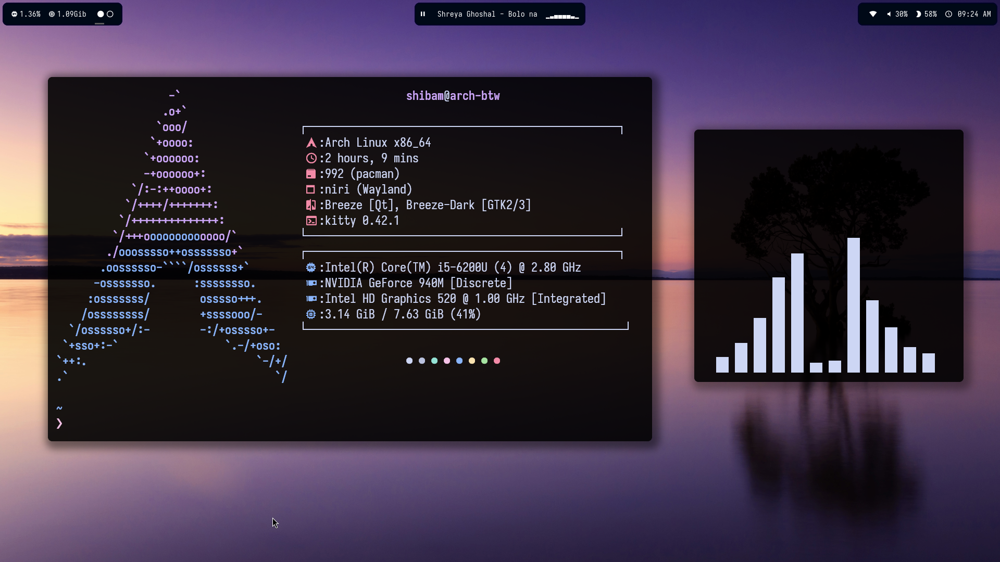
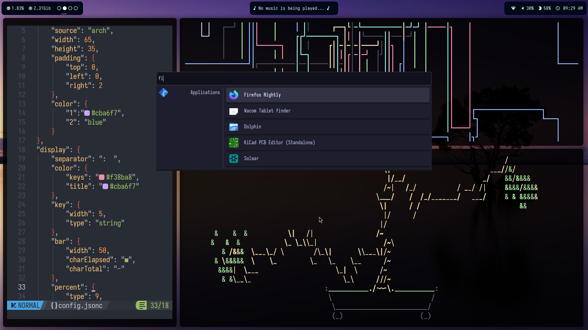

# Niri Dotfiles

## Overview🖊️

This is my first ever rice with niri, and for now I am daily driving it.I absolutely love the scrolling layout, easy configuration and basically everything about niri. I have used hyprland, qtile, i3, and sway, but so far, niri is the most user-friendly wm i could find.

I tried to keep it minimal while being functional, and ofcourse all in dark colors. The combo of black and white looks pretty sleek doesn't it?

## Screenshots📷




## Dependencies🔗

- [niri](https://github.com/YaLTeR/niri)
- [waybar](https://github.com/Alexays/Waybar)
- [fastfetch](https://github.com/fastfetch-cli/fastfetch)
- [anyrun](https://github.com/anyrun-org/anyrun)
- [cava](https://github.com/karlstav/cava)
- [ncmpcpp](https://github.com/ncmpcpp/ncmpcpp)
- [mpd](https://wiki.archlinux.org/title/Music_Player_Daemon)
- [wlogout](https://github.com/ArtsyMacaw/wlogout)

(Optional ones, just there in the screenshot)
- [pipes.sh](https://github.com/pipeseroni/pipes.sh)
- [cbonsai](https://github.com/mhzawadi/homebrew-cbonsai)

## Setup 🖥️

Setting this rice up isn't difficult, just follow these steps:

> ![NOTE]
> I am on arch, thus using paru(an AUR helper), it may vary depending on your distro. The package names may vary too.

1. Install dependencies:

> I built waybar manually, because cava module wasn't working, follow the waybar wiki if you want to do the same

```bash
paru -S niri fastfetch cava waybar anyrun ncmpcpp mpd wlogout
```

2. Clone this repo & move the files to your config dir:

> ![WARNING]
> This will replace any previous config files, so make sure to prepare a backup! Also note that any directory inside the config directory named screenshots or file called README.md will be deleted!

```bash
git clone https://github.com/ShibamRoy9826/niri-dotfiles.git
cp -r niri-dotfiles/* ~/.config/
rm -rf ~/.config/screenshots/ ~/.config/README.md
```

3. That's it! now, use your display manager like SDDM and select "niri" during login, if anything doesn't work, please raise an issue in this repo!

